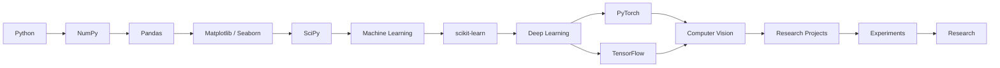

<div align="center">


<br/>

<a href="https://github.com/rachananp">

</a>
<a href="https://www.linkedin.com/in/rachana-n-p-6a0ba8389/">

</a>
<a href="mailto:rachananpfreelancing@gmail.com">

</a>

<br/><br/>


</div>

---

<h2 align="center">🧠 Who Am I?</h2>

```python
class RachanaNP:

    def __init__(self):

        self.name = "Rachana N.P"
        self.role = "Computer Science Engineering Student"
        self.university = "VTU"
        self.location = "Bengaluru, India 🇮🇳"

        self.primary_interests = [
            "Artificial Intelligence",
            "Machine Learning",
            "Deep Learning",
            "Computer Vision",
            "AI Research",
            "Edge AI"
        ]

        self.exploring = [
            "Physiological Signal Analysis",
            "IoT + Intelligent Systems",
            "Model Drift Detection",
            "Real-world ML Applications"
        ]

        self.current_goal = (
            "Build strong foundations → "
            "build serious systems → "
            "do meaningful research"
        )

    def philosophy(self):
        return "Consistency > Motivation"


me = RachanaNP()
```

---

<h2 align="center">🚀 About Me</h2>

I'm a **Computer Science Engineering student** at VTU with a strong interest in **Artificial Intelligence, Machine Learning, Deep Learning, Computer Vision and research-oriented systems**.

My goal isn't simply to build applications that "use AI".

I'm interested in understanding **why models work, how they fail, how they behave with real-world data, and how research ideas can be transformed into working systems.**

My projects increasingly sit at the intersection of:

<div align="center">

`AI` • `Machine Learning` • `Deep Learning` • `Computer Vision`
`Physiological Signals` • `Edge AI` • `IoT` • `Research`

</div>

I'm currently strengthening my foundations in the mathematical, programming and ML concepts required to move deeper into **AI research**.

---

<h2 align="center">🔬 My Research Direction</h2>

<div align="center">

```text
                  ┌─────────────────────┐
                  │       AI / ML       │
                  └──────────┬──────────┘
                             │
             ┌───────────────┼───────────────┐
             ↓               ↓               ↓
       Deep Learning   Computer Vision   Data Science
             │               │               │
             └───────────────┼───────────────┘
                             ↓
                    Real-World Signals
                             │
                             ↓
                  Edge AI + Intelligent
                       Systems
                             │
                             ↓
                     🔬 RESEARCH
```

</div>

### Areas I'm particularly interested in

* 🧠 Machine Learning
* 🔬 Deep Learning
* 👁️ Computer Vision
* 📊 Data-driven modelling
* 🫀 Physiological signal analysis
* ⚡ Edge AI
* 📡 IoT-based intelligent systems
* 📈 Distribution / concept drift
* 🧪 Experimental ML research

---

# 🧩 Featured Projects

## 🫀 PhysioShift / VitalDrift

### Physiological Signal Analysis + ML Drift Detection

An ongoing research-oriented project exploring how machine-learning systems behave when **physiological data distributions change over time**.

```text
ECG / PPG / GSR
      │
      ▼
Data Collection
      │
      ▼
Preprocessing
      │
      ▼
Feature / Representation Learning
      │
      ▼
ML / Deep Learning
      │
      ▼
Distribution Drift
      │
      ▼
Detection + Monitoring
```

### Technologies / concepts

`Python` `NumPy` `Pandas` `SciPy`
`Machine Learning` `Deep Learning` `LSTM`
`Physiological Signals` `ECG` `PPG` `SpO₂` `GSR`
`ESP32` `Sensors` `Edge AI`

---

## 🌊 LakeGuard AI

### AI for Environmental Monitoring

An AI-driven project exploring how machine learning and intelligent sensing can be applied to **real-world environmental problems**.

**Focus**

```text
Environmental Data
        ↓
Data Processing
        ↓
Machine Learning
        ↓
Pattern Detection
        ↓
Intelligent Monitoring
```

---

## 🛡️ Kavach — AadhaarShield

### AI + Digital Security

A technology-focused project exploring approaches toward **protecting sensitive identity information** and improving digital security.

**Core idea**

`Security` → `Intelligent Systems` → `Detection` → `Protection`

---

## 🧠 Tattva

An AI-oriented project built around applying technology to a real-world problem, with an emphasis on **practical implementation rather than purely theoretical modelling**.

---

# 🧪 My ML Stack

<div align="center">

### 🐍 Programming


<br/><br/>

### 📊 Data Science


<br/><br/>

### 🤖 Machine Learning


<br/><br/>

### 🧠 Deep Learning — Currently Exploring


<br/><br/>

### 👁️ Computer Vision — Exploring


<br/><br/>

### ⚙️ Development & Tools


<br/><br/>


</div>

---

# 🗺️ My AI Learning Journey



---

# 🔬 Research → Experiment → Build

<div align="center">

|     🔬 Research    |   🧪 Experiment  |     🛠️ Build    |
| :----------------: | :--------------: | :--------------: |
|     Read papers    |  Test hypotheses | Build prototypes |
|    Identify gaps   |   Analyse data   |   Deploy models  |
|   Form questions   |   Train models   |  Solve problems  |
| Understand methods | Evaluate results |      Iterate     |

</div>

> **My goal is to gradually move from "learning ML" to actually thinking like an ML researcher.**

---

# 🏆 Milestones

<div align="center">

| Achievement                     | Status                |
| ------------------------------- | --------------------- |
| 🎓 Computer Science Engineering | `In Progress`         |
| 📄 Research Publication         | `Published`           |
| 🏆 Hackathons                   | `Participated`        |
| 🥇 Hackathon Recognition        | `4th Prize — ₹15,000` |
| 🤖 AI / ML Projects             | `Building`            |
| ⚡ Edge AI / IoT                 | `Exploring`           |
| 🧠 Deep Learning                | `Learning`            |
| 🔬 AI Research                  | `Long-term Focus`     |

</div>

---

# 📚 Currently Learning

```python
learning = {

    "Data Science": [
        "NumPy",
        "Pandas",
        "Matplotlib",
        "Seaborn",
        "SciPy"
    ],

    "Machine Learning": [
        "scikit-learn",
        "Feature Engineering",
        "Model Evaluation",
        "ML Pipelines"
    ],

    "Deep Learning": [
        "Neural Networks",
        "PyTorch",
        "TensorFlow",
        "LSTM",
        "CNNs"
    ],

    "Computer Vision": [
        "Image Processing",
        "OpenCV",
        "Vision Models"
    ],

    "Research": [
        "Research Papers",
        "Experiment Design",
        "Literature Review",
        "Model Analysis"
    ]
}
```

---

# 🌍 Beyond Technology

<div align="center">

### 🇮🇳 Bengaluru → 🌍 Global

</div>

I enjoy exploring technology, research, languages, communities and new ideas beyond the classroom.

### 🗣️ Languages

`English` • `Kannada` • `Hindi` • `German 🇩🇪`

### 🇩🇪 Fun Fact

I've maintained a **960-day Duolingo streak** while learning German.

```text
DAY 001
   │
   ├── DAY 100
   │
   ├──── DAY 365
   │
   ├──────── DAY 500
   │
   ├──────────────── DAY 900
   │
   └────────────────────── DAY 960 🔥
```

---

# 📊 GitHub Analytics

<div align="center">


<br/><br/>


</div>

---

# 🐍 Contribution Activity

<div align="center">


</div>

---

# 🎯 Current Mission

<div align="center">

```text
╔══════════════════════════════════════════╗
║                                          ║
║        BUILD STRONG FOUNDATIONS          ║
║                    ↓                     ║
║          BUILD SERIOUS PROJECTS          ║
║                    ↓                     ║
║          UNDERSTAND THE THEORY           ║
║                    ↓                     ║
║          CONDUCT EXPERIMENTS             ║
║                    ↓                     ║
║            DO REAL RESEARCH              ║
║                    ↓                     ║
║        BUILD SOMETHING MEANINGFUL       ║
║                                          ║
╚══════════════════════════════════════════╝
```

</div>

---

# 📌 What I'm Working Toward

```text
                 CURIOSITY
                     │
                     ▼
               LEARN THE BASICS
                     │
                     ▼
               BUILD PROJECTS
                     │
                     ▼
              STUDY RESEARCH
                     │
                     ▼
             ASK BETTER QUESTIONS
                     │
                     ▼
               RUN EXPERIMENTS
                     │
                     ▼
                CONTRIBUTE
                     │
                     ▼
               AI RESEARCH 🔬
```

---

<h2 align="center">🤝 Let's Connect</h2>

<div align="center">

<a href="https://github.com/rachananp">

</a>

<a href="https://www.linkedin.com/in/rachana-n-p-6a0ba8389/">

</a>

<a href="mailto:rachananpfreelancing@gmail.com">

</a>

</div>

<br/>

<div align="center">

### *"Don't aim to be impressive. Aim to become undeniable."*

<br/>


</div>
